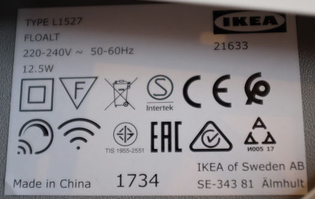
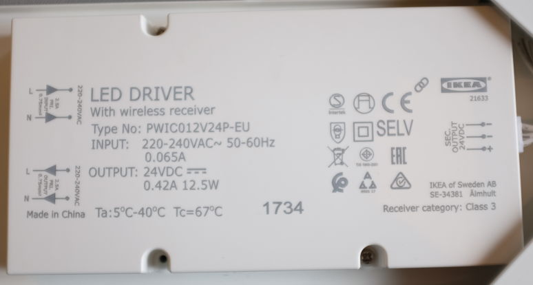
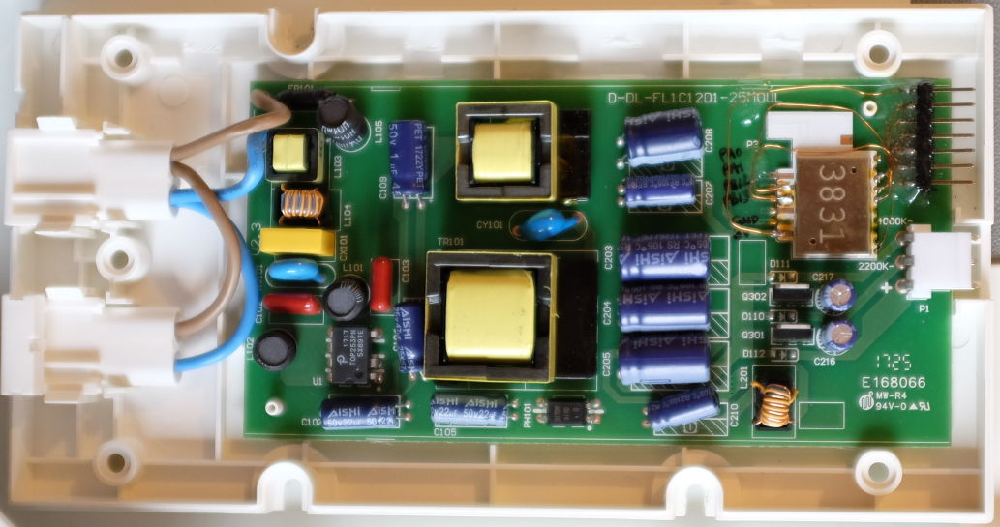
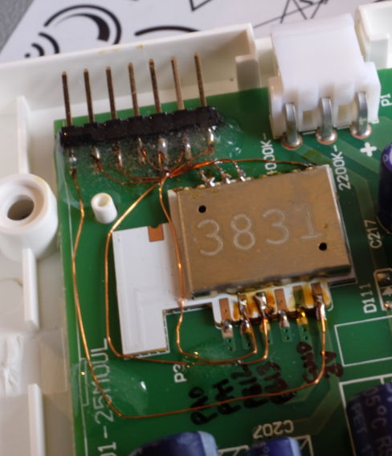

This describes how to extract, patch and reflash the firmware of a
Floalt 30x30 panel (L1527) to increase the number of brightness levels
(from 7 to 33) and the range of brightness (lowest brightness changes
from 5% to 0.05%).  At the end of this guide is discussion of why you
might (or indeed might not) want to do this.

This mod was carried out, and this guide written, by
[zw](https://github.com/zw).

# Caveats

* Performing this modification might cause your panel to break, catch
  fire, explode.  Your warranty with Ikea is most definitely void, and
  there's no warranty from me.  If that worries you, don't try this.

* I can't provide the whole patched firmware, only the patch, since the
  full firmware is Ikea's property.  That means...

* The patch is only known to work on a 30x30 panel running firmware
  v1.2.217.  (It could probably be extended to other Tradfri hardware
  and firmware versions with a little work.)  If you have a way to
  check, it would be prudent to verify that you're running v1.2.217
  (or can obtain a v1.2.217 firmware image elsewhere) before embarking
  on this.

* I have no idea how hubs/gateways handle rolling out firmware upgrades
  (I don't have one) but to use this hack you'd have to inhibit upgrade
  somehow.  Otherwise upgrades will presumably blow away the patch and
  restore factory firmware (although for all I know, performing this
  patch might make gateways refuse to upgrade the panel).
  This also means you have to be content to run v1.2.217 forever, or
  until someone ports the patch to later firmware versions.

* I have no idea whether a panel controlled with APIs/hubs/gateways
  would continue to work once patched.  It works for me with a remote
  control (E1524, or a clone of that).

# Skills and equipment (for the way I did it)

* Soldering iron, reasonable soldering skills, suitable gauge insulated
  wire, multimeter

* a Debian/Ubuntu installation and some familiarity with command-line
  Linux, including enough `git` to clone something and to build it

* a SWD probe; these instructions assume the use of a $3 Blue Pill
  (STM32F103 board) from China via eBay running
  [Black Magic Probe][bmp], preparation of which is outlined below; to
  follow those instructions you'll also need a USB<-\>serial adapter
  * an alternative to the USB<-\>serial adapter is the STLink-V2 clone
    available cheaply on eBay, but then you'll need to follow some other
    guide

* 4x1 0.1" male header and some epoxy to firmly attach it to the board

* 4x1 female-to-female Dupont cable, or individual wires; probably a
  breadboard plus several more wires/headers for convenient hookup of
  serial lines to the Pill

# Process

## Preparing the Blue Pill as a SWD probe

This makes use of the very handy [Black Magic Probe][bmp] (BMP)
firmware.

 [bmp]: https://github.com/blacksphere/blackmagic/wiki

Solder up the Pill's supplied headers.

Follow [Param Aggarwal's instructions][pill2bmp] with the following
modifications:

* Move the `BOOT0` jumper before connecting any power.  Saves a reset.

* "Now download the stm32loader python script": BMP includes a script
  for flashing a bare Blue Pill over serial, so you shouldn't need
  `stm32loader`.  Skip that step.  But you probably will need to
  `sudo apt install python-serial`.

* "Now we need the binary": instead of `brew`, on Debian/Ubuntu you want
  `sudo apt install gcc-arm-none-eabi`

* "Once we have the DFU file": instead of the `stm32loader` way, use
  `../scripts/bootprog.py blackmagic_dfu.bin`.  When that has finished
  successfully, restore the jumpers to their defaults (as described),
  disconnect the USB<-\>serial cable VCC, connect the Pill to your Linux
  machine with a regular USB cable, and then press the reset button.

* "Now we are ready to add": use `lsusb` on Linux to check that the Pill
  has rebooted into DFU mode.  If it has, the USB<-\>serial cable has
  served its purpose and should be removed.

* "For the actual firmware": instead of `brew` and `dfu-util`, use:
  `../scripts/stm32_mem.py blackmagic.bin`.  Once that succeeds you have
  a probe, so stop there; the part about "Make the connections" is
  outdated and the rest is unnecessary here.

* Press the reset button.  Confirm, using `lsusb` or by checking for
  `/dev/ttyACM*`, that the probe is visible and presents two USB serial
  ports.

Some other notes for nerds:

* Older versions of the BMP firmware don't know about the specifics of
  flashing/erasing EFM32.  The latest will probably be fine.  I used
  `7032abd`.  Don't use the ancient v1.6.

* It's assumed that your Blue Pill has the undocumented/unsupported
  128KiB flash capacity.  I've bought maybe fifteen over the years from
  various eBay vendors and never seen one with less capacity.  If your
  Pill really is too small, note that some folks have successfully
  reduced the size of BMP by [removing targets they didn't need][trimming].

 [trimming]: https://primalcortex.wordpress.com/2017/06/13/building-a-black-magic-debug-probe/
 [pill2bmp]: https://medium.com/@paramaggarwal/converting-an-stm32f103-board-to-a-black-magic-probe-c013cf2cc38c

## Modifying the panel for SWD access

* Switch the panel off at the wall and unplug it, then unplug the other
  end of the mains cable where it enters the panel's power supply.

* Disconnect the 24V LED strip from the other side of the panel's power
  supply.

* Undo (and set aside) the two or three screws holding the power supply
  to the panel.

* Flip the power supply over and undo (and set aside) the four or five
  screws that hold the power supply case together.

* Remove the PCB from the case.

* Secure the 4x1 0.1" male header to the module side of the PCB.  I used
  two-part epoxy between PCB and spacer, being careful to avoid getting
  any glue on the pins themselves.  The picture of mine shows 7x1
  header; I needed three more pins (the ones nearer the 24V output) for
  the reverse-engineering work.  There's no need to make a hole in the
  case.

* Using the [pinout image](/images/pinout.png) as a guide, solder wires
  to connect:
  * VCC to header pin 1
  * PF1 (SWDIO) to header pin 2
  * PF0 (SWCLK) to header pin 3
  * either GND to header pin 4

* Check continuity on all four connections, and check for the absence of
  shorts.

* Use a fine-tipped permanent marker to label GND and 3V3, since a
  simple cable flip here might expose your module to reverse polarity
  and fry the module, the Pill, a USB port, or all three.

## Test SWD connection

* Your Pill should be connected to your Linux machine by just a regular
  USB cable at this point.

* Do **not** plug your modded PCB into the mains.  We'll power the EFM32
  module from the Pill.

* Connect your Pill to your modded PCB with your 4x1 female-to-female
  Dupont cable, or individual wires; if using a 4-wire cable, be very
  careful to observe polarity.  All wires go straight through: 3V3 to
  VCC, GND to GND, SWDIO to SWDIO, SWCLK to SWCLK.

* Let's switch to your home directory so that it's easy to find the
  extracted firmware image): `cd`

* `sudo apt install arm-none-eabi-gdb`

* `arm-none-eabi-gdb`

* At the gdb prompt:
  * `target extended-remote /dev/ttyACM0`
  * `mon sw`

* You should see: `1   EFM32` or similar

* Upon confirming the soldering functional, I then added a generous
  second blob of two-part epoxy to protect the wires, and a blob to any
  long wire at risk of being pulled off the board.  Obviously you'll
  want to quit `gdb` (`quit`) and disconnect USB and SWD wires to do
  this.  You are modifying (the low-voltage side of) a device with mains
  input, and you don't want wires rattling around in there should they
  come loose.

## Extract the existing firmware

* Plug things back in and repeat the "Testing SWD" steps to get back to a gdb prompt.
* Reconfirm that `mon sw` shows a target, just in case the extra glue
  broke something.
* At the `gdb` prompt: `att 1`
* `dump memory floalt-flash-pristine.bin 0x0 0x40000`
* Make a backup of this untouched image, because you never know.
* Open another terminal in the same place.

## Make a patched version of the existing firmware

* Download [the patch](floalt-mdl.vcdiff)
* `sudo apt install xdelta3`
* `xdelta3 -d -s floalt-flash-pristine.bin floalt-mdl.vcdiff floalt-flash-patched.bin`
* If `xdelta3` refuses to perform the patch, it's probably because your
  panel wasn't running v1.2.217.  You're out of luck, unless you can
  find someone willing to send you a v1.2.217 image.  Or somehow
  reconstitute one from an [OTA update][otau].  Or learn how to
  reverse-engineer and make the same tweak in your panel's firmware
  version.

 [otau]: firmwares/ikea/otau/stable/159698-TRADFRI-driver-lp-1.2.217.ota.ota.signed

## Flash the patched image back

* I think `gdb` accepts only an ELF, not a flat binary, to flash.  So,
  make one from the flat binary:
  * `arm-none-eabi-objcopy --input-target binary --output-target elf32-little floalt-flash-patched.bin floalt-flash-patched.elf`
* In the gdb terminal:
  * `load floalt-flash-patched.elf`
* I often saw an error here, but it would never cause the following
  verify to fail.
* `compare-sections` and check that it looks OK.

## Put the panel back together and try it out

You *may* need to re-pair the panel with your remote(s) and/or
gateway(s); I think I did re-pair, but I don't think I needed to.

# Context

I did this because I wanted a programmable sunrise alarm clock (ideally
also letting the panel act as a nightlight, on demand).  There are
probably better options there:

 * buy some other brand of LED light that dims enough out of the box
   (Hue?)
 * buy a sunrise alarm appliance with that feature
 * buy a mains dimmer appliance with a plug and socket and that feature
 * take this route but replace Ikea's firmware with something open

This also doesn't get you all the way there.  The other part of this
hack was to remove an EFM module from a GU10 bulb (LED1650), clone the
white hockey-puck remote (E1524) firmware onto that, wire that up to a
microcontroller (I used a Nucleo L432), and write slow-fade firmware for
the microcontroller.
